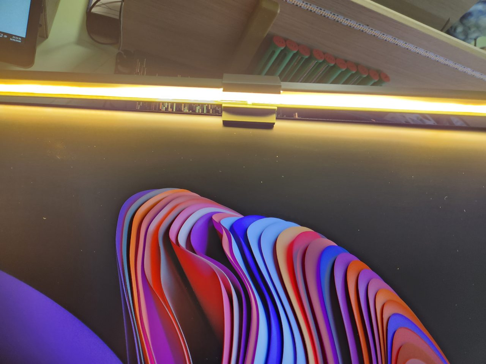
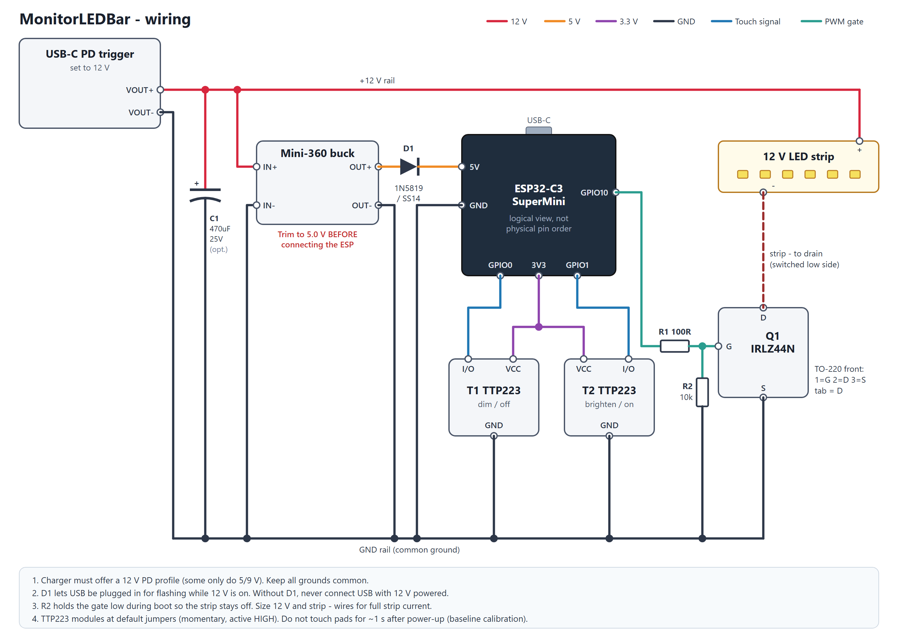

# MonitorLEDBar

A touch-controlled LED light bar that sits on top of a PC monitor. Built around an ESP32-C3 SuperMini, two TTP223 touch pads and a 12 V single-color LED strip, powered from a single USB-C PD charger.



## Features

- **Touch control** - tap to turn on/off, touch and hold to dim or brighten with a smooth, perceptually even ramp
- **Web interface** - live on/off and brightness, plus all settings, from any browser on your network
- **Configurable pads** - swap pad roles, choose between on/off taps or step-by-X% taps, set the ramp speed
- **Brightness limits** - minimum and maximum brightness, and a fixed or last-used level when turning on
- **Remembers its state** - comes back at the same brightness after a power cut
- **Home Assistant** - automatic MQTT discovery as a dimmable light, with WiFi signal and IP diagnostics
- **Multi-monitor pairing** - pair several bars over ESP-NOW so the pads on any bar control all of them
- **Easy setup and updates** - WiFi setup portal on first boot, firmware updates over the air from the web page
- **mDNS** - reachable at `http://<device-name>.local`

## 3D printed enclosure

**Print files:** [MakerWorld](https://makerworld.com/models/3362536).

Step-by-step build with CAD renders and photos: [docs/ASSEMBLY.md](docs/ASSEMBLY.md).

## Hardware

| Part | Notes |
|------|-------|
| ESP32-C3 SuperMini | main controller |
| 2x TTP223 touch module | default jumpers (momentary, active HIGH) |
| IRLZ44N MOSFET | low-side PWM switch for the strip |
| 12 V single-color LED strip | |
| USB-C PD trigger board | set to 12 V, charger must offer a 12 V PD profile |
| Mini-360 buck converter | 12 V to 5 V for the ESP32 |
| 1N5819 / SS14 Schottky diode | lets you plug in USB while 12 V is on |
| 100R and 10k resistors | MOSFET gate resistor and pull-down |
| 470 uF 25 V capacitor | optional bulk capacitor |

## Wiring



More detail, including a text version and power-up checklist, in [docs/WIRING.md](docs/WIRING.md). Trim the Mini-360 to 5.0 V **before** connecting the ESP32.

## Building and flashing

The project uses [PlatformIO](https://platformio.org/).

```sh
pio run -t upload
```

The first flash has to be over USB. After that, updates can be uploaded from the Maintenance page of the web interface.

## First setup

1. Power the bar. With no saved WiFi it opens an access point named `LEDBar-XXXX`.
2. Connect to it and choose your WiFi network in the setup page.
3. The bar restarts and joins your network. Open `http://ledbar-xxxx.local` (or its IP address) to reach the web interface.

## Home Assistant

Requires an MQTT broker (for example the Mosquitto broker add-on) and the MQTT integration in Home Assistant. Enter the broker details on the **Home Assistant** page of the web interface; the bar then shows up under Settings > Devices & services > MQTT.

## Pairing multiple bars

All bars must be on the same WiFi network. Open the **Pairing** page on one bar and click **Pair** next to another bar in the "Bars nearby" list. Paired bars share one state: pads, the web interface or Home Assistant on any of them control the whole group.
